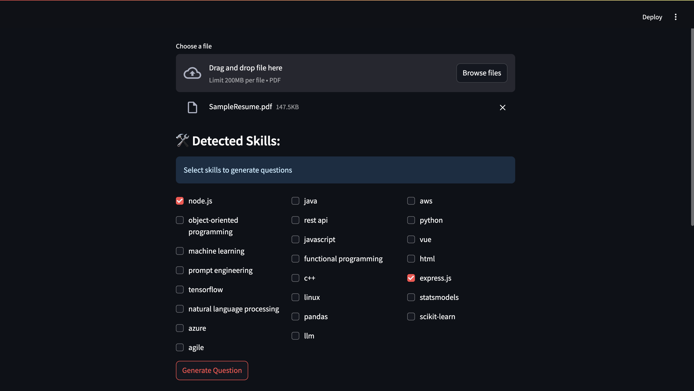
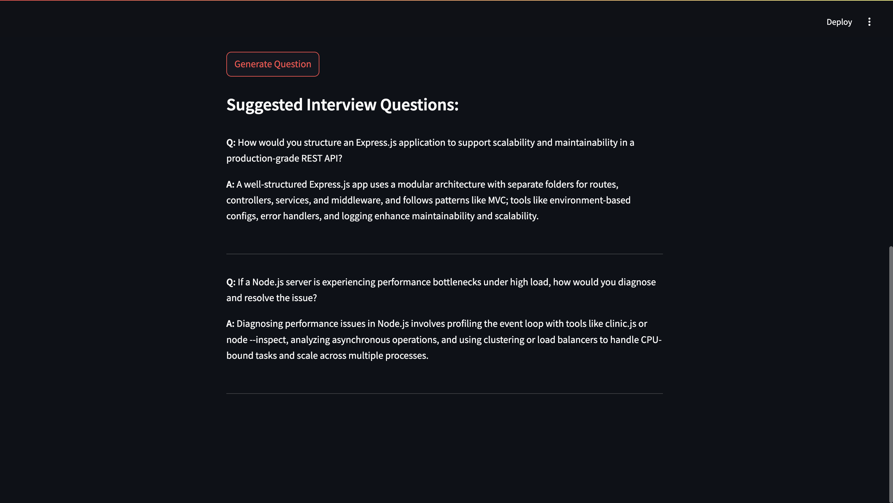

# AI Resume Screening Helper  
A streamlined tool to extract technical skills from resumes, evaluate their relevance, and generate personalized interview questions using AI.

---

## Table of Contents
- [Screenshots](#screenshots)
- [Tech Stack](#tech-stack)
- [Features](#features)
- [Installation](#installation)
- [Environment Variables](#environment-variables)
- [Running Locally](#running-locally)

---

## Screenshots

<table>
  <tr>
    <td align="center">
      
      <br><sub><b>Extracted Skills from Resume</b></sub>
    </td>
    <td align="center">
      
      <br><sub><b>Generated Screening Questions</b></sub>
    </td>
  </tr>


  
</table>

---

## Tech Stack

- **Frontend/UI:** Streamlit  
- **Prompt Generation:** OpenAI GPT-4 (via API)    
- **NLP:** PyMuPDF, spaCy, SentenceTransformers  
- **Data Visualization:** Plotly  


## Features

- Upload resume and extract technical skills
- Rank skills based on semantic similarity to predefined master list
- Generate personalized, project-based interview questions using OpenAI
- Modular and extensible Python backend

---

## Installation

```bash
# Clone the repository
git clone https://github.com/yourusername/ai-resume-screening-helper.git
cd ai-resume-screening-helper

# Create virtual environment
python -m venv venv
source venv/bin/activate  # On Windows: venv\Scripts\activate

# Install dependencies
pip install -r requirements.txt
```

## Environment Variables 
Create a .env file in root directory
```env
OPENAI_API_KEY=your_openai_api_key
PATH_TO_SKILLS=data/skills.txt
```

## Running Locally

```bash
streamlit run app.py
```
